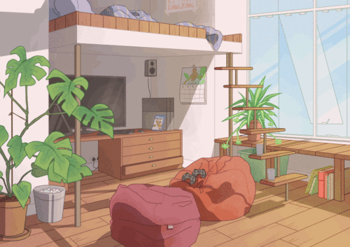

<h1 align="center">Olá, Mundo! Me chamo Edmilton. Bem-vindo ao meu perfil.</h1>

 

💻 Atualmente trabalho como Desenvolvedor back-end e front-end  🍃 Estudando as tecnologias Spring Boot, Typescript, Vue.js e Quasar 

<h3 align="left">Entre em contato:</h3>

 

<h3 align="left">Linguagens e Ferramentas:</h3>

  
<h3>Estatísticas</h3>

  

    
    
  

